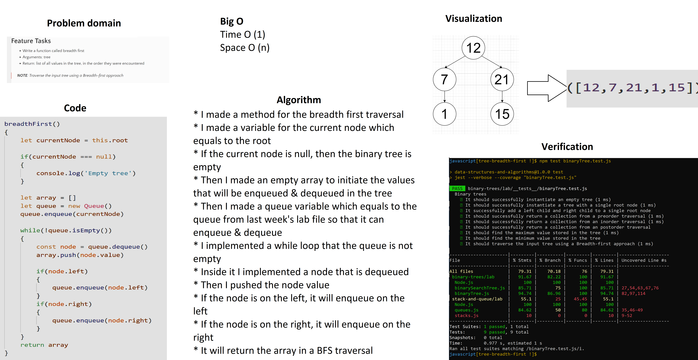
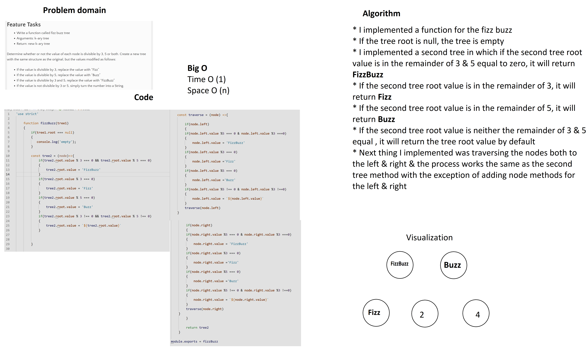

# Whiteboards

## Code challenge 16

# Binary trees
Create a Node class that has properties for the value stored in the node, the left child node, and the right child node.

## Challenge
* Can successfully instantiate an empty tree
* Can successfully instantiate a tree with a single root node
* Can successfully add a left child and right child to a single root node
* Can successfully return a collection from a preorder traversal
* Can successfully return a collection from an inorder traversal
* Can successfully return a collection from a postorder traversal

## Approach & Efficiency
I just follow the tasks that I'm going to do for the lectures & assignments.

## Big O
* Time O(n)
* Space O(1)