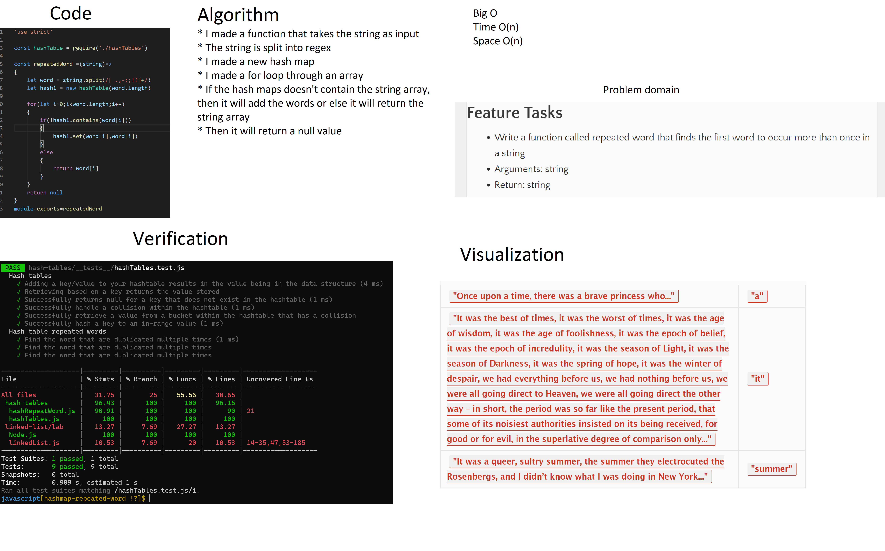
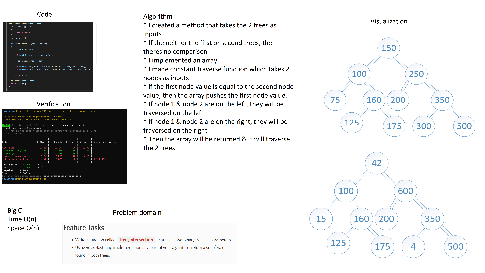

# Hashtables
Implement a Hashtable Class with the following methods: adding, getting, containg & hashing methods

## Whiteboards

## Challenge

* Adding a key/value to your hashtable results in the value being in the data structure
* Retrieving based on a key returns the value stored
* Successfully returns null for a key that does not exist in the hashtable
* Successfully handle a collision within the hashtable
* Successfully retrieve a value from a bucket within the hashtable that has a collision
* Successfully hash a key to an in-range value

## Approach & Efficiency

I just follow the tasks that I'm going to do for the lectures & assignments.

## Big O

* Time O(1)
* Space O(n)

## API

Implement a Hashtable Class with the following methods:

* add
   * Arguments: key, value
   * Returns: nothing
   * This method should hash the key, and add the key and value pair to the table, handling collisions as needed.

* get
   * Arguments: key
   * Returns: Value associated with that key in the table

* contains
   * Arguments: key
   * Returns: Boolean, indicating if the key exists in the table already.

* hash
   * Arguments: key
   * Returns: Index in the collection for that key