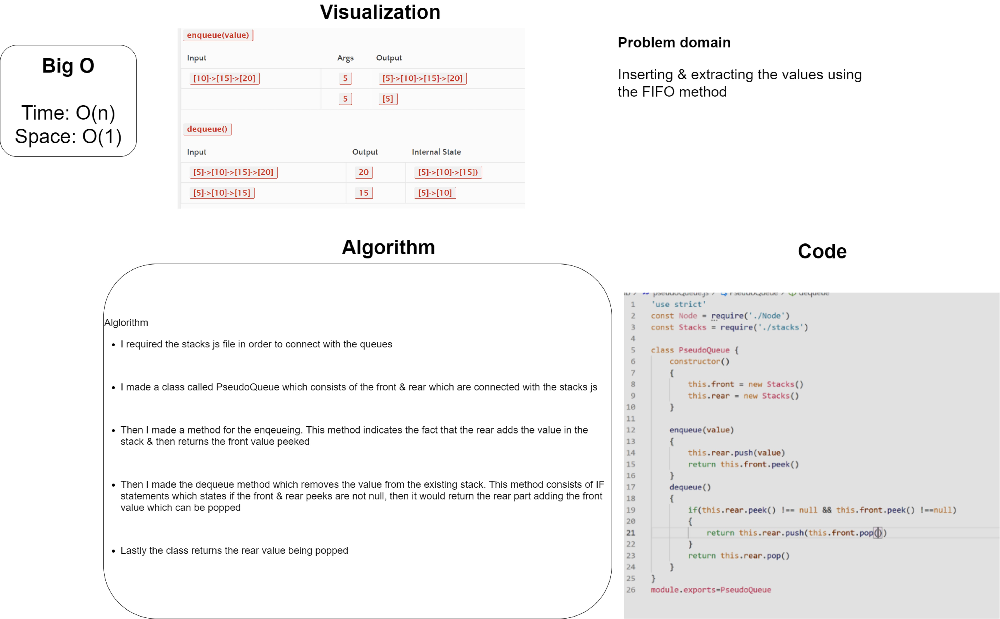
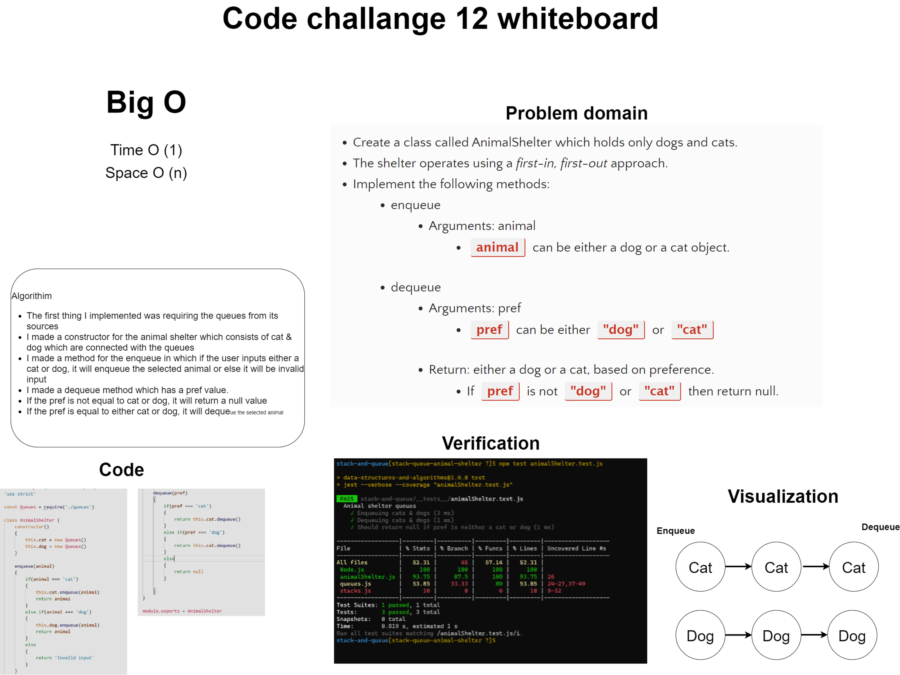

# Code Challenge 11 whiteboard

# Stacks and Queues
Using a Linked List as the underlying data storage mechanism, implement both a Stack and a Queue

## Challenge
* Can successfully push onto a stack
* Can successfully push multiple values onto a stack
* Can successfully pop off the stack
* Can successfully empty a stack after multiple pops
* Can successfully peek the next item on the stack
* Can successfully instantiate an empty stack
* Calling pop or peek on empty stack raises exception
* Can successfully enqueue into a queue
* Can successfully enqueue multiple values into a queue
* Can successfully dequeue out of a queue the expected value
* Can successfully peek into a queue, seeing the expected value
* Can successfully empty a queue after multiple dequeues
* Can successfully instantiate an empty queue
* Calling dequeue or peek on empty queue raises exception

## Approach & Efficiency
I just follow the tasks that I'm going to do for the lectures & assignments.

## Big O
* Time O(n)
* Space O(1)

## API

### Methods for stacks

* pop(): Remove the top item from the stack
* push(item): Add an item to the top of the stack
* peek(): Return the item at the top of the stack
* isEmpty(): Returns true if the stack is empty

### Methods for queues

* enqueue(item): Remove the top item from the queue
* dequeue(): Add an item to the top of the queue
* peek(): Return the item at the top of the queue
* isEmpty(): Returns true if the queue is empty